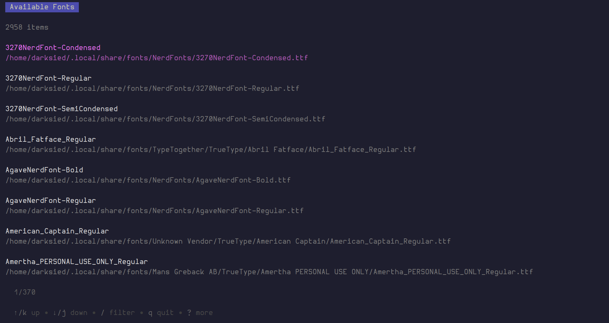

# fbrowse

Font Browser. On Mac and Linux.

### why

I use i3 as my setup, and I don't want to install a plethora of gnome and god forbid, qt bloatwares.

### how

```shell
make build.cli
# by default copies to ~/.local/bin

fbrowse
```

### todo

- [ ] render a preview text

### looks


